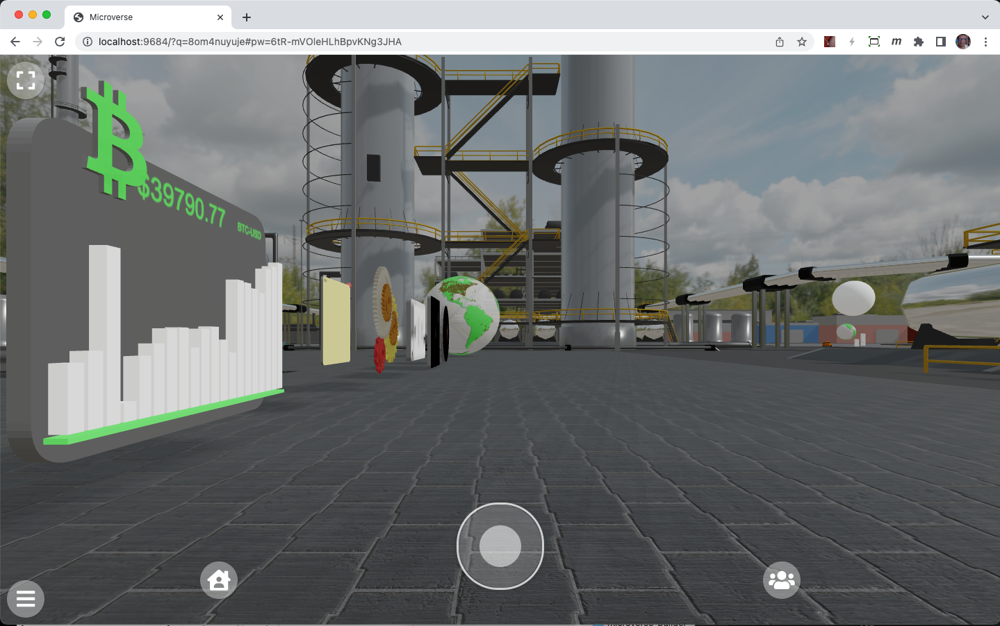

# Croquet Microverse Builder
## Quick Start Guide

**Copyright (c) 2022 Croquet Corporation**

<https://croquet.io>

<info@croquet.io>

## Introduction

This guide will enable you to quickly set up Croquet Microverse Builder. Refer to tutorials in the docs directory for its key concepts and features that let you build new shared worlds.

## The Simple Steps for Impatient
1. Clone the Github repository from <https://github.com/croquet/microverse-builder>.
    <br>`git clone git@github.com:croquet/microverse-builder.git`
2. Obtain your Croquet API Key from <https://croquet.io/keys/>.
3. Open a terminal and change the working directory to your new `microverse-builder` folder.
   <br>`cd microverse-builder`
4. Create the apiKey.js file from apiKey.js-example and the API Key above, along with a dot separated name for the appId.
   <br>`cp apiKey.js-example apiKey.js # and edit apiKey.js`
 
5. Run:
```npm i```
in the terminal, and then run
```npm start```

6. Open browser at `localhost:9684`.

7. Copy the URL shown in the browser tab and copy it into a new tab. Also, replace `localhost` in the URL with the IP address of the computer (something like 192.168.0.123) and open it from another device on the local network.

## Detailed Explanations
---

### The Github Repository

You can find the most up to date Croquet Microverse library as well as this document and tutorials in the `microverse-builder` Github repository. Cloning this repository will give you almost everything you will need to get started creating your own Croquet Microverse.

    `# git clone git@github.com:croquet/microverse-builder.git`

---
### Obtain your API Key

Developing any Croquet application requires an API key that you can obtain from Croquet. You can sign up as a Croquet developer and obtrain an API key at the [Croquet Developers Portal](https://croquet.io/keys).

Press "Create one here" under "Sign In" message to create a Croquet account. Once you sign up your first key is automatically generated, and you can also create app specific keys with URL restrictions (see the deployment section of this document).

### Create the apiKey.js File
Create a file called `apiKey.js` by copying `apiKey.js-example` to `apiKey.js`. Then edit the two properties called `apiKey` and `appId` in the file. The appId needs to be [dot-separated words](https://developer.android.com/studio/build/application-id), such as "com.example.myapp". Refer to [join](https://croquet.io/docs/croquet/Session.html#.join) for other parameters you can specify.

#### apiKey.js-example

```
const apiKey = "<insert your apiKey from croquet.io/keys>";
const appId = "<specify your own appId such as com.foo.mymicroverse>";
export default {apiKey, appId};

// you may export other Croquet session parameters to override default values.
```

Place your Croquet generated API key and an application ID of your choice and save `apiKey.js`.

#### apiKey.js
```
const apiKey = "1_a2b3c4e5f6g7h8i9j0kxyzzyqwerty142nsj6fasdsadad";
const appId = "com.example.david.awesome-app";
export default {apiKey, appId};
```

### Start Croquet Microverse

You can now set up the the local servers and start them. In the terminal (in the `microverse-builder` folder), first run `npm install` in the directory:
    <br>`# npm install`

Then run `npm start` in the same directory:
    <br>`# npm start`

This will run two servers. One is the file server on localhost:9684. The other is the watch-server that enables you to inject code changes into a running session. You can also run them separately by running `npm run file-server` and `npm run watch-server`.

You should see something similar to this:


### Open Croquet Microverse in a browser

To start the demo world for Croquet Microverse, open `localhost:9684` with your web browser.



The URL will change - both a new session ID and a password are autogenerated and added to the URL. This full URL allows you to enter the same world from other tabs and devices.

If you have another device on the local network and the computer is visible from the device by an IP address, you can join in the same session from the device. Replace localhost with the IP address of the computer (such as 192.168.0.123) in the full URL and open it from other device. You can deploy the system to your server, as described in the deployment section, and make it publicly available.

### Deployment

You can copy all files in `behaviors`, `assets`, `lib`, `meta`, and `worlds` along with `index.html` and `apiKey.js`, to your publicly accessible HTTP server to have your own deployment. You can also use a hosting services such as Netlify and Vercel, which let you connect your Github repository to automate deployment. Note that the auto generated default apiKey for your Croquet account allows anybody to use it from any site. You should create a new apiKey with URL restriction.

Many files in the `assets` directory used for the default demo worlds are not necessary for your own world. You can remove them from your deployment safely.

### Updates

Croquet will update this repository with new features and bug fixes continuously. Most of files affected will be under the `lib` and `assets` directory but occasionally some files in the worlds, including `default.js`, will be modified. If you edit `default.js` in your clone, fetching upstream updates may cause conflicts. Making your world file under a different name and launch it with the URL option `?world=` should avoid it, but also it is fine to simply take your version of `default.js` and merge the rest of changes.

## Resources
---

### Croquet.io
<https://croquet.io/> is the best place to get started with what Croquet Microverse is and what it can do.

Croquet Microverse uses the [Croquet Library](https://croquet.io/docs/croquet) and the [Worldcore framework](https://croquet.io/docs/worldcore). Also, the 3D rendering depends on [Three.js](https://threejs.org/). To develop your own behaviors with new visual appearances, you need to be familiar with those libraries.

### Discord

The best resource for help in developing Croquet Microverse worlds is on our Discord server where you can ask questions, view examples, and see the Metaverse being constructed while you watch. Join the [Croquet Discord server](https://discord.gg/9U9MKSbJXS).

