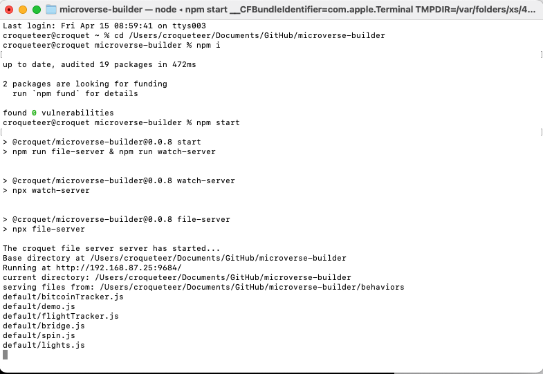

# Croquet Microverse Builder Quick Start Guide

## Introduction

This guide will enable you to quickly set up the Croquet Microverse Builder. Refer to tutorials in the docs directory for its key concepts and features that let you build new shared worlds.

## Prerequisite

1. [Node.js and npm](https://nodejs.org/)
2. [Git](https://git-scm.com)

Node.js, npm and git are large software packages and explaining them is not in the scope of this document. We only use their most basic features. If you don't have those packages on your computer yet, spend a little time to look for a simplest installation method for your platform.

## Detailed Installation Steps

### Clone or Fork the Github Repository

You can find the up to date Croquet Microverse Builder along with documentation in the [microverse-builder Github repository](https://github.com/croquet/microverse-builder). Cloning this repository will give you almost everything you will need to get started creating your own Croquet Microverse.

`git clone https://github.com/croquet/microverse-builder.git`

Alternatively, fork the repository to your account and clone your repository.

---
### Obtain your API Key

Developing any Croquet application requires an API key that you can obtain from Croquet. You can sign up as a Croquet developer and obtrain an API key at the [Croquet Developers Portal](https://croquet.io/keys).

Create a Croquet account by following the the "Create one here" link on the sign in page. Once you sign up, your first key is automatically generated. Additional application specific API keys with URL restrictions can be created as well.  (See the deployment section of this document for further details).

### Create the apiKey.js File
Create a file called `apiKey.js` by copying `apiKey.js-example` to `apiKey.js`. Then edit the two properties in the file named `apiKey` and `appId`. The appId needs to be [dot-separated words](https://developer.android.com/studio/build/application-id), such as "com.example.myapp". Refer to the API document of [`Session.join()`](https://croquet.io/docs/croquet/Session.html#.join) for other parameters you can specify.

#### apiKey.js-example

```
const apiKey = "<insert your apiKey from croquet.io/keys>";
const appId = "<specify your own appId such as com.foo.mymicroverse>";
export default {apiKey, appId};

// you may export other Croquet session parameters to override default values.
```

Enter your Croquet API key and an application ID of your choice in the `apiKey.js` file and save it.

#### apiKey.js
```
const apiKey = "1_a2b3c4e5f6g7h8i9j0kxyzzyqwerty142nsj6fasdsadad";
const appId = "com.foo.mymicroverse";
export default {apiKey, appId};
```

### Install Packages and Start the Croquet Microverse

Set up the the local servers. In a terminal window, change to the microverse-builder folder then run the `npm install` command to install packages:
* `cd microverse-builder` (or the directory where the microverse-builder repo was downloaded.)
* `npm install`

Start the local servers.  In the same terminal window, run `npm start` to start the servers.
* `npm start`

This will start two servers. The first is the file server on localhost:9684. The second is the watch-server that enables you to inject code changes into a running session. 

The servers can be run independently as well. 
* `npm run file-server` starts the file server.  
* `npm run watch-server` starts the watch-server.

You should see something similar to this:



### Open the Croquet Microverse in a browser

To enter the demo world for the Croquet Microverse, open `localhost:9684` in your web browser.


The URL will change - both a new session ID and a password are autogenerated and added to the URL. This full URL allows you to enter the same world from other tabs and devices.

If you have another device on the local network and the computer is visible from the device by an IP address, you can join in the same session from the device. Replace localhost with the IP address of the computer (such as 192.168.0.123) in the full URL and open it from other device. You can deploy the system to your server, as described in the deployment section, and make it publicly available.

### Deployment

You can copy all files in `behaviors`, `assets`, `lib`, `meta`, and `worlds` along with `index.html` and `apiKey.js` to your publicly accessible HTTP server to have your own deployment. You can also use a hosting services such as Netlify and Vercel, which let you connect your Github repository to automate deployment. Note that the auto generated default apiKey for your Croquet account allows anybody to use it from any site.  In order to protect your API key from unauthorized use, you should create a new apiKey with URL restriction limited to your site.

Many of files in the `assets` directory are used for the default demo worlds and may not be necessary for your own world.  You can safely remove them from your deployment if you are not using them.

### Updates

Croquet will continuously update this repository with new features and bug fixes. Most of files affected will be under the `lib` and `assets` directory but occasionally some files in the worlds, including `default.js`, will be modified. If you edit `default.js` in your clone, fetching upstream updates may cause conflicts. Making your world file under a different name and launching it with the URL option `?world=` can avoid conflicts.  However, the recommended approach is to merge our changes into your version of `default.js`.

## Resources
---

### Croquet.io
<https://croquet.io/> is the best place to get started with what the Croquet Microverse is and what it can do.

The Croquet Microverse uses the [Croquet Library](https://croquet.io/docs/croquet) and the [Worldcore framework](https://croquet.io/docs/worldcore). Additionaly it depends on [Three.js](https://threejs.org/) for 3D rendering. To develop your own behaviors with new visual appearances, you will need to be familiar with those libraries.

### Discord

The best resource for help in developing Croquet Microverse worlds is on our Discord server. The Croquet Discord server is where you can ask questions, view examples, and see the Metaverse being constructed while you watch. Join the [Croquet Discord server](https://discord.gg/9U9MKSbJXS).

